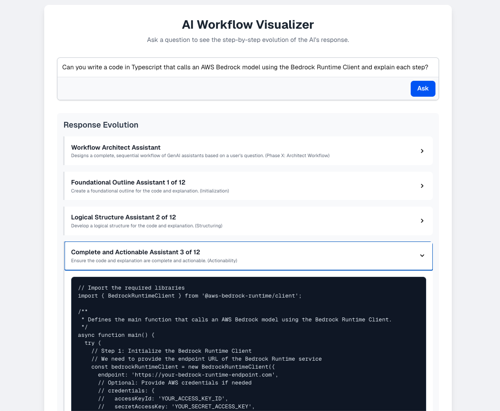
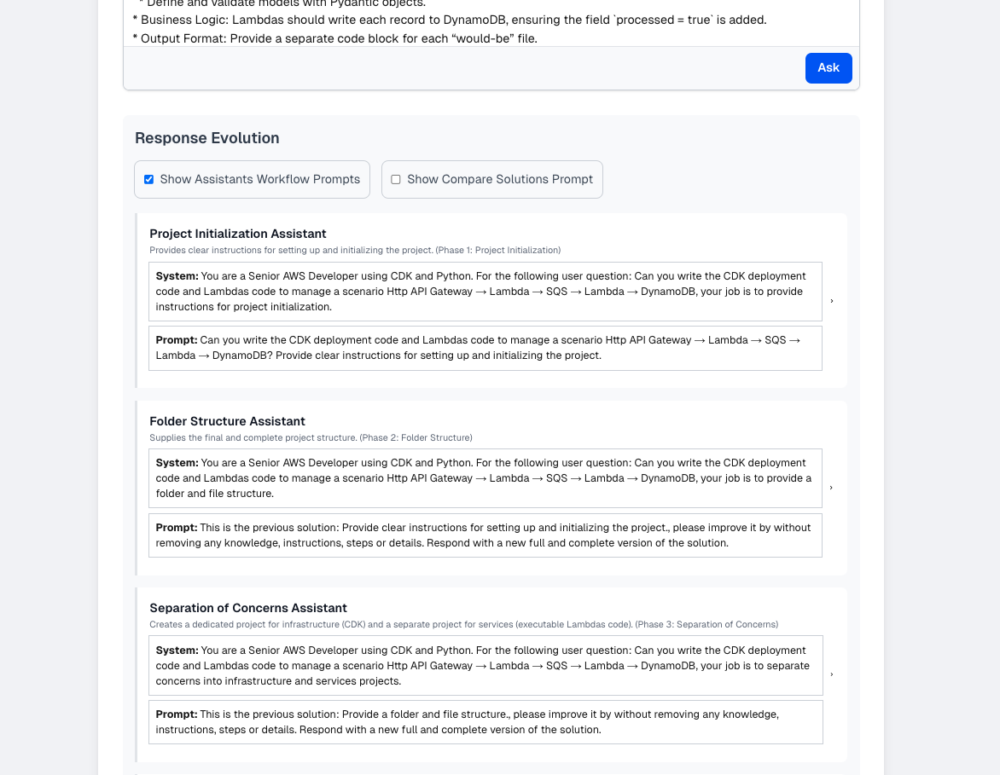
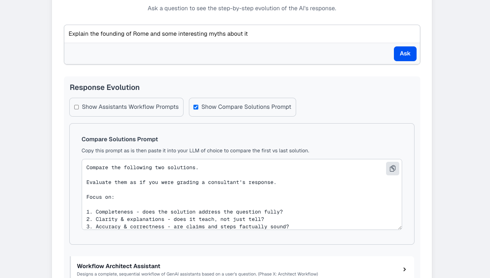

# AI Workflow Architect

This repository contains the code for an experimental AI architecture. The system is designed to take a user's question and, instead of answering it directly, first design a dynamic, multi-step workflow of specialized AI assistants to produce a high-quality, comprehensive response.

The core of the project is a "Workflow Architect," a meta-assistant that analyzes a user's question and designs a complete execution plan for other "worker" assistants to follow.

## A Note on the Experiment/POC:

**Is is what it is:** an experiment that so-so improves an LLM's original response by iterating on it results.

Sometimes it yields really good results, sometimes not so much. It depends on the type of task. In general, I believe that for simpler, less sophisticated models, it does improve the results. Sometimes a lot, but it's not deterministic, so occasionally it flukes. There are also issues with models that have small context windows, since context overflow can be a problem.

**Another thing:** having the Workflow Architect generate the workflow directly in JSON might be a bit much for some models. Even if it works, it seems that forcing the structure can distract the model from focusing on the actual goals and instructions for the assistants. Maybe a better approach would be to have the model respond with the workflow goals, and then let the system construct the workflow structure from that response.

**One more issue:** designing a linear structure from the start isn't always optimal. Simulating a more conversational workflow might work better, and that's something I'll probably test as well.

**It's doesn't work for simpler stuff:** if you ask a super simple question, like "what is the result of `2 + 2`?" the workflow will actually make things worse. The first answer is always best for trivial stuff, and the final result will just be nonsense.

Yet, overall, it was a good experiment.

## Example Workflow Generation

This example shows how the **Workflow Architect** takes a user's question and designs a multi-step plan. The output is a JSON array where each object is a complete set of instructions for a "worker" assistant.

### User Question Example

The user would send a question like this to the system's API:

```text
"I am planning a trip to Rome, Italy. Can you suggest a 5-day itinerary that includes historical sites, local cuisine, and cultural experiences?"
```

### Workflow Architect Prompt

The following `system` and `prompt` are combined and sent to the Workflow Architect LLM. The `system` prompt contains the high-level blueprint and rules, while the `prompt` contains the specific user question for this task.

#### System Prompt

```text
You are a GenAI Workflow Architect. Your job is to design an iterative, step-by-step execution plan for a team of AI assistants to build the best possible response to the original user question.

## Mandatory Requirements

Your final output MUST be a single JSON array of "Assistant Steps".

## Assistant Step Definition (The JSON Structure You Must Create. All fields are mandatory for all assistants)

- "name": (required) A descriptive name for the assistant, indicating its directive (e.g., "Explanatory Depth Assistant 3 of N").

- "role": (required) A one-sentence description of the assistant's purpose.

- "system": (required) The complete system prompt for the assistant, including identity, context, and any relevant background information and important instructions. The system prompt MUST include the original user question in a section clearly labeled "User Question: <Original User Question>".

- "prompt": (required) The specific user prompt for this step's LLM call. The prompt for the first step uses the original question. Every subsequent prompt MUST be only the placeholder string "This is the previous solution: <PREVIOUS_RESULT>, please improve it by without removing any knowledge, instructions, steps or details. Respond with a new full and complete version of the solution.".

- "phaseName": (required) The name of the workflow phase.


## Example JSON Output

[
  {
    "name": "Explanatory Depth Assistant 3 of N",
    "role": "Enhances the depth of explanations in the solution.",
    "system": "You are an expert <Field of Study>. For the following user question: <Original User Question>", your job is to...",
    "prompt": "<Original User Question> for the first assistant",
    "phaseName": "Phase X: Architect Workflow"
  },
  {
    "name": "Clarity and Simplicity Assistant 1 of N",
    "role": "Focuses on making the solution as clear and simple as possible.",
    "system": "You are an expert <Field of Study>. For the following user question: <Original User Question>", your job is to...",
    "prompt": "This is the previous solution: <PREVIOUS_RESULT>, please improve it by without removing any knowledge, instructions, steps or details. Respond with a new full and complete version of the solution.",
    "phaseName": "Phase X: Architect Workflow"
  }
]

## Your Final Output

- Your final response MUST BE ONLY the raw and valid JSON array of Assistant Steps.

## Recommendations for a good quality workflow

1.  **First, determine the single 'Field of Study.'** Analyze the user's question to identify the core expertise required to answer it (e.g., "Senior Next.js and TypeScript Developer," "Expert Historian of Ancient Rome," "Creative Fiction Editor"). This single Field of Study will be the expert persona for **every** assistant in the workflow.

2.  **Second, design a logical 'Path of Directives.'** Your primary task is to create a sequence of assistants that iteratively refine the answer. To do this, you must choose a logical sequence of "directives" for the assistants to adopt.

3.  **Third, ensure cohesion and progression.** Each assistant's directive must build upon the previous ones, ensuring a clear progression towards a high-quality final answer. Avoid redundant or conflicting directives.


## Feedback and knowledge gained from experience of past workflows

- Providing each assistant with the original user question in its system prompt can help maintain context.

- Providing instructions to maintain format can help ensure consistency.

- Workflows with 10 to 15 assistants are often effective.

- Verbose and detailed system prompts help ensure each assistant understands its role.
```

#### Prompt

```text
Design the complete assistant workflow for the following user question:\n<question>"I am planning a trip to Rome, Italy. Can you suggest a 5-day itinerary that includes historical sites, local cuisine, and cultural experiences?</question>
```

### Example Architect Response

This is an example of the kind of JSON the architect would produce. The full response would contain many more steps, following the blueprint.

```json
[
  {
    "name": "Trip Planning Assistant 1 of 15",
    "role": "Creates an initial 5-day itinerary for Rome, Italy, including historical sites, local cuisine, and cultural experiences.",
    "system": "You are an expert Travel Planner specializing in Rome, Italy. For the following user question: \"I am planning a trip to Rome, Italy. Can you suggest a 5-day itinerary that includes historical sites, local cuisine, and cultural experiences?\", your job is to provide a suggested 5-day itinerary.",
    "prompt": "I am planning a trip to Rome, Italy. Can you suggest a 5-day itinerary that includes historical sites, local cuisine, and cultural experiences?",
    "phaseName": "Phase 1: Initial Itinerary Planning"
  },
  {
    "name": "Destination Knowledge Assistant 2 of 15",
    "role": "Enhances the itinerary with comprehensive information about Rome's historical sites.",
    "system": "You are an expert Historian specializing in Ancient Rome. For the following user question: \"I am planning a trip to Rome, Italy. Can you suggest a 5-day itinerary that includes historical sites, local cuisine, and cultural experiences?\", your job is to ensure the historical sites included are accurate and comprehensive.",
    "prompt": "This is the previous solution: <PREVIOUS_RESULT>, please improve it by adding more detailed information about historical sites. Respond with a new full and complete version of the solution.",
    "phaseName": "Phase 2: Historical Site Enrichment"
  },
  {
    "name": "Culinary Experience Assistant 3 of 15",
    "role": "Adds local cuisine experiences to the itinerary.",
    "system": "You are an expert Food Critic specializing in Italian cuisine. For the following user question: \"I am planning a trip to Rome, Italy. Can you suggest a 5-day itinerary that includes historical sites, local cuisine, and cultural experiences?\", your job is to suggest local cuisine experiences.",
    "prompt": "This is the previous solution: <PREVIOUS_RESULT>, please improve it by including authentic local cuisine experiences. Respond with a new full and complete version of the solution.",
    "phaseName": "Phase 3: Culinary Enrichment"
  },
  {
    "name": "Cultural Immersion Assistant 4 of 15",
    "role": "Incorporates cultural experiences into the itinerary.",
    "system": "You are an expert Cultural Anthropologist specializing in Italian culture. For the following user question: \"I am planning a trip to Rome, Italy. Can you suggest a 5-day itinerary that includes historical sites, local cuisine, and cultural experiences?\", your job is to suggest cultural experiences.",
    "prompt": "This is the previous solution: <PREVIOUS_RESULT>, please improve it by including cultural experiences. Respond with a new full and complete version of the solution.",
    "phaseName": "Phase 4: Cultural Enrichment"
  },
  {
    "name": "Logistics and Timing Assistant 5 of 15",
    "role": "Optimizes the itinerary for time and travel logistics.",
    "system": "You are an expert Travel Logician. For the following user question: \"I am planning a trip to Rome, Italy. Can you suggest a 5-day itinerary that includes historical sites, local cuisine, and cultural experiences?\", your job is to ensure the itinerary is feasible and well-timed.",
    "prompt": "This is the previous solution: <PREVIOUS_RESULT>, please improve it by optimizing for travel time and logistics. Respond with a new full and complete version of the solution.",
    "phaseName": "Phase 5: Logistical Optimization"
  },
  {
    "name": "Local Insights Assistant 6 of 15",
    "role": "Provides insider tips and local insights for the itinerary.",
    "system": "You are a local Roman with extensive knowledge of the city. For the following user question: \"I am planning a trip to Rome, Italy. Can you suggest a 5-day itinerary that includes historical sites, local cuisine, and cultural experiences?\", your job is to add insider tips.",
    "prompt": "This is the previous solution: <PREVIOUS_RESULT>, please improve it by adding local tips and insights. Respond with a new full and complete version of the solution.",
    "phaseName": "Phase 6: Local Insights Integration"
  },
  {
    "name": "Clarity and Simplicity Assistant 7 of 15",
    "role": "Ensures the itinerary is clear and easy to follow.",
    "system": "You are an expert Communications Specialist. For the following user question: \"I am planning a trip to Rome, Italy. Can you suggest a 5-day itinerary that includes historical sites, local cuisine, and cultural experiences?\", your job is to make the itinerary clear and simple.",
    "prompt": "This is the previous solution: <PREVIOUS_RESULT>, please improve it by making it clearer and simpler. Respond with a new full and complete version of the solution.",
    "phaseName": "Phase 7: Clarity Enhancement"
  },
  {
    "name": "Comprehensive Coverage Assistant 8 of 15",
    "role": "Verifies the itinerary covers all requested aspects.",
    "system": "You are an expert Itinerary Reviewer. For the following user question: \"I am planning a trip to Rome, Italy. Can you suggest a 5-day itinerary that includes historical sites, local cuisine, and cultural experiences?\", your job is to ensure all aspects are covered.",
    "prompt": "This is the previous solution: <PREVIOUS_RESULT>, please improve it by ensuring it covers historical sites, local cuisine, and cultural experiences. Respond with a new full and complete version of the solution.",
    "phaseName": "Phase 8: Comprehensive Coverage"
  },
  {
    "name": "Practicality and Feasibility Assistant 9 of 15",
    "role": "Assesses the practicality and feasibility of the itinerary.",
    "system": "You are an expert Travel Realist. For the following user question: \"I am planning a trip to Rome, Italy. Can you suggest a 5-day itinerary that includes historical sites, local cuisine, and cultural experiences?\", your job is to assess and improve practicality.",
    "prompt": "This is the previous solution: <PREVIOUS_RESULT>, please improve it by ensuring it is practical and feasible. Respond with a new full and complete version of the solution.",
    "phaseName": "Phase 9: Practicality Assessment"
  },
  {
    "name": "Sequence and Flow Assistant 10 of 15",
    "role": "Improves the sequence and flow of the itinerary.",
    "system": "You are an expert Itinerary Flow Specialist. For the following user question: \"I am planning a trip to Rome, Italy. Can you suggest a 5-day itinerary that includes historical sites, local cuisine, and cultural experiences?\", your job is to optimize the sequence.",
    "prompt": "This is the previous solution: <PREVIOUS_RESULT>, please improve it by optimizing the sequence and flow. Respond with a new full and complete version of the solution.",
    "phaseName": "Phase 10: Sequence Optimization"
  },
  {
    "name": "Detail Enhancement Assistant 11 of 15",
    "role": "Adds detailed information to the itinerary.",
    "system": "You are an expert Researcher. For the following user question: \"I am planning a trip to Rome, Italy. Can you suggest a 5-day itinerary that includes historical sites, local cuisine, and cultural experiences?\", your job is to add detailed information.",
    "prompt": "This is the previous solution: <PREVIOUS_RESULT>, please improve it by adding more detailed information. Respond with a new full and complete version of the solution.",
    "phaseName": "Phase 11: Detail Enhancement"
  },
  {
    "name": "Consistency and Accuracy Assistant 12 of 15",
    "role": "Ensures the itinerary is consistent and accurate.",
    "system": "You are an expert Fact-Checker. For the following user question: \"I am planning a trip to Rome, Italy. Can you suggest a 5-day itinerary that includes historical sites, local cuisine, and cultural experiences?\", your job is to verify consistency and accuracy.",
    "prompt": "This is the previous solution: <PREVIOUS_RESULT>, please improve it by ensuring consistency and accuracy. Respond with a new full and complete version of the solution.",
    "phaseName": "Phase 12: Consistency and Accuracy"
  },
  {
    "name": "User Needs Alignment Assistant 13 of 15",
    "role": "Ensures the itinerary aligns with the user's needs and preferences.",
    "system": "You are an expert User Advocate. For the following user question: \"I am planning a trip to Rome, Italy. Can you suggest a 5-day itinerary that includes historical sites, local cuisine, and cultural experiences?\", your job is to ensure alignment with user needs.",
    "prompt": "This is the previous solution: <PREVIOUS_RESULT>, please improve it by ensuring it meets the user's needs. Respond with a new full and complete version of the solution.",
    "phaseName": "Phase 13: User Needs Alignment"
  },
  {
    "name": "Final Review and Polish Assistant 14 of 15",
    "role": "Conducts a final review and polish of the itinerary.",
    "system": "You are an expert Itinerary Editor. For the following user question: \"I am planning a trip to Rome, Italy. Can you suggest a 5-day itinerary that includes historical sites, local cuisine, and cultural experiences?\", your job is to finalize and polish the itinerary.",
    "prompt": "This is the previous solution: <PREVIOUS_RESULT>, please improve it by conducting a final review and polish. Respond with a new full and complete version of the solution.",
    "phaseName": "Phase 14: Final Review"
  },
  {
    "name": "Presentation Assistant 15 of 15",
    "role": "Formats the final itinerary for clarity and readability.",
    "system": "You are an expert Presentation Specialist. For the following user question: \"I am planning a trip to Rome, Italy. Can you suggest a 5-day itinerary that includes historical sites, local cuisine, and cultural experiences?\", your job is to format the itinerary for clarity.",
    "prompt": "This is the previous solution: <PREVIOUS_RESULT>, please improve it by formatting for clarity and readability. Respond with a new full and complete version of the solution.",
    "phaseName": "Phase 15: Final Presentation"
  }
]
```

---

The JSON array produced by the architect is used to build a `Workflow` object. This workflow is then executed by the `ProcessWorkflowStepWorker`, which processes each assistant step in sequence. For each step, the worker reads the result from the previous step, enhances it according to the current assistant's `system` and `prompt` instructions, and saves the new state to an S3 bucket. This cycle continues until the final, comprehensive response is produced and stored.

---

### Example Final Response (Abridged)

After the full workflow has been executed by all the assistants, the final output is a comprehensive, multi-section guide.

```text
**A Comprehensive 5-Day Itinerary for Rome**

**Introduction**
Rome, the Eternal City, is a destination that captivates travelers with its rich history, stunning architecture, and delectable cuisine. This 5-day itinerary is designed to provide an unforgettable experience, balancing iconic landmarks with authentic cultural immersion.

...

**Day 1: Echoes of Ancient Rome**
The first day is dedicated to exploring the heart of the ancient world. The morning begins with a visit to the **Colosseum and Roman Forum**, where you can walk through the ruins and gain a deeper understanding of the city's history. In the afternoon, explore the **Pantheon** and the charming streets of the historic center.

...

**(Content for Days 2, 3, 4, and 5, as well as sections on Budgeting, Recommendations, Hidden Gems, and more, are abridged)**

...

By following these tips, travelers can have a fantastic and unforgettable experience in Rome. Buon viaggio!
```

---

## Core Concepts & Architecture

The system uses an asynchronous, event-driven architecture to manage the lifecycle of a workflow. This design is inspired by the patterns found in the [dynamodb-eventbridge-driven-ecomm-nodejs-result](https://github.com/mutchinick/dynamodb-eventbridge-driven-ecomm-nodejs-result) repository.

The main components are:

- **WorkflowArchitect:** The definition for the strategist "meta-assistant." Its `system` prompt instructs an LLM to analyze the user's question and design the entire multi-step execution plan.

- **Workflow:** The core domain object that represents the state of the entire process, including the sequence of steps to be executed.

- **WorkflowPhase:** The architect's design process is guided by a multi-phase blueprint to ensure every generated workflow is consistent and robust.

- **SendQueryApi:** An API endpoint that receives the user's question and initiates the workflow.

- **DeployWorkflowAssistantsWorker:** A worker that calls the Workflow Architect to design the execution plan and emits a `WorkflowDeployedEvent`.

- **ProcessWorkflowStepWorker:** The core execution engine that processes each assistant step in the workflow.

## Technology Stack

- **Language:** TypeScript
- **AI/LLM:** Amazon Bedrock
- **AI SDK:** Vercel AI SDK
- **Infrastructure as Code:** AWS CDK
- **Testing:** Jest

---

## Important Note for Windows Users

_(If you are running Linux or MacOS you are fine, you can jump to the "How to Deploy" section just below)_

My most sincere apologies. This repository uses long file paths which can exceed the default > 260-character limit on Windows. This might cause a "Filename too long" error during `git clone` or `npm install`. To fix this permanently, you should enable long path support for both Git and the Windows OS. To do this please perform the following steps.

**Configure Git:** Open a regular command prompt or terminal and run this command:

```bash
git config --global core.longpaths true
```

**Configure Windows:** Open **PowerShell as an Administrator** and run this command. You may need to restart for the change to take full effect.

```powershell
New-ItemProperty -Path "HKLM:\SYSTEM\CurrentControlSet\Control\FileSystem" -Name "LongPathsEnabled" -Value 1 -PropertyType DWORD -Force
```

---

## How to Deploy

The infrastructure is defined using the AWS CDK and is located in the `infra` folder.

#### 1. Enable Bedrock Model Access

Before deploying, you must enable access to the foundation model you plan to use in Amazon Bedrock:

- Checkout the [AWS Bedrock model access documentation](https://docs.aws.amazon.com/bedrock/latest/userguide/model-access.html)
- Open the [Amazon Bedrock console](https://console.aws.amazon.com/bedrock/) in your target AWS region.
- Request and enable access to the model(s) (e.g., Claude, Llama, Titan) for your AWS account.
- Once access is granted, configure the model identifier in `infra/lib/settings.ts`.

Example:

```ts
export const settings = {
  ...
  Bedrock: {
    MODEL_ID: "us.meta.llama4-scout-17b-instruct-v1:0", // Add your desired Bedrock Model ID
  },
};
```

This ensures that the workers can successfully call the Bedrock API.

#### 2. Install Dependencies

First, navigate to the `services` directory and install the Node.js dependencies for the Lambda functions.

```bash
cd services
npm install
```

#### 3. Configure Deployment ID

_Only if you want to change it. It's not required and should work out of the box. If you do change it, just be mindful with the length because some AWS resources impose limits_

Inside the `infra/package.json` file, there is a `deployment_prefix` property. This value will be prepended to all AWS resources created by the CDK (APIs, Lambdas, Queues, etc.). Think of it as a unique ID for your deployment stack.

_Example `infra/package.json`:_

```json
"config": {
  "deployment_prefix": "aiWorkflowArchitect"
},
```

#### 4. Set up AWS Credentials

The deployment script constructs an AWS profile name using the pattern `<deployment_prefix>-<stage>`. You need to set up a corresponding profile in your `~/.aws/credentials` file.

For a `deployment_prefix` of `aiWorkflowArchitect` and a `stage` of `dev`, the profile name would be `aiWorkflowArchitect-dev`.

_Example `~/.aws/credentials`:_

```ini
[aiWorkflowArchitect-dev]
aws_access_key_id = AKIA...
aws_secret_access_key = SeHzc6...
region = us-east-1
```

> Choose the AWS region you want to deploy to. The example uses `us-east-1` (N. Virginia).

#### 5. Deploy the Stack

Navigate to the `infra` folder, install its dependencies, and run the deploy command, passing the desired stage name as an argument.

```bash
# If you are in the services folder
cd ../infra

# Install infra dependencies
npm install

# Deploy to the 'dev' stage
npm run deploy dev
```

You can use any stage name you like, which is great for spinning up ephemeral test environments (e.g., `npm run deploy my-test`). Just make sure the profile for that stage is set correctly in the AWS credentials file.

The CDK will synthesize the stack and may prompt you to approve the creation of IAM roles and policies. Accept the changes to proceed. The deployment typically takes 4-5 minutes.

> **NOTE:** After a successful deployment, the script automatically writes the necessary environment variables (like API base URLs) into `.env` files. This makes it easy to start testing the system immediately. These files are configured for the two testing methods detailed in the upcoming sections: one for the VSCode REST Client and another for the Next.js UI.

---

## How to Teardown

If you want to teardown the deployed infrastructure in AWS just run the following command from the `infra` folder.

```bash
# Assuming you have deployed to the 'dev' stage
npm run destroy dev
```

---

## How to play with it

The repository also includes a simple UI for sending questions to the system and monitoring responses. It's a single-page application built with Next.js, located in the `ui` folder. This app isn't deployed to AWS, but you can easily run it locally since the required environment variables are injected by the `cdk-runner` script.

To get started, navigate to the `ui` folder and install the dependencies:

```bash
# From the repository root
cd ui
npm install
```

Then, launch the application, open it in your browser, ask a question, and watch the workflow unfold:

```bash
# Run the app in development mode
npm run dev
```

Here are a few screenshots to give you a feel for the UI:



You can drill into each workflow step and inspect both the `system prompt` and the `user prompt` that was sent to the model.



There's also a handy feature that generates a prompt you can copy-paste into ChatGPT, Gemini, Claude, etc., to compare the first solution with the final, iterated result.


